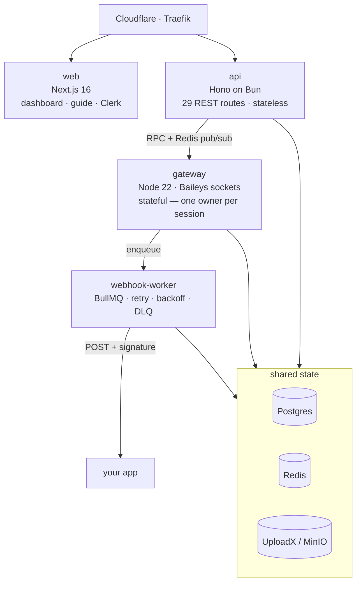
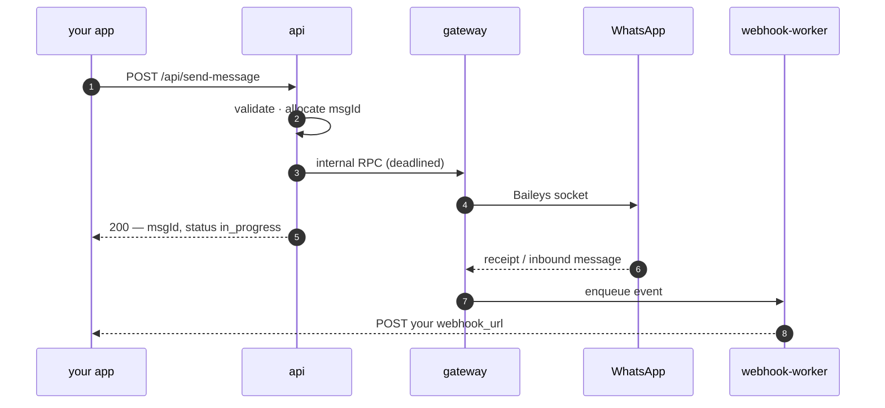

<p align="center">
  
</p>

<h1 align="center">wapi</h1>

<p align="center">
  <strong>WhatsApp over HTTP, on your own box.</strong><br>
  A self-hosted REST API for WhatsApp, wire-compatible with WasenderAPI.
</p>

<p align="center">
  <a href="https://wapi.crafter.run">Site</a> ·
  <a href="https://wapi.crafter.run/docs">Guide</a> ·
  <a href="https://api.wapi.crafter.run/docs">API reference</a> ·
  <a href="https://api.wapi.crafter.run/openapi.json">OpenAPI</a>
</p>

---

Link a number, get an API key, send and receive messages over plain HTTP.

```bash
curl -X POST https://api.wapi.crafter.run/api/send-message \
  -H "Authorization: Bearer $KEY" \
  -d '{"to":"+51999888777","text":"hello"}'
```

```json
{ "success": true, "data": { "msgId": 100024, "jid": "+51999888777", "status": "in_progress" } }
```

Meta's Cloud API covers business messaging, not the conversations most teams actually run
on — group chats, personal threads, the number people already message. Reaching those means
driving a real WhatsApp client. wapi does that and puts a stable REST surface in front of it.

## Architecture



The gateway is the only stateful piece: a WhatsApp session is a live socket that exactly one
process may own. Everything else scales sideways. Credentials live in Postgres rather than on
disk, so a redeploy reconnects instead of asking you to scan a QR again.

The dashboard is both halves of that picture: link a number and watch its QR, then browse its
contacts, groups and message log, watch webhook deliveries land as they happen, and run a
health check that sends one message to the number itself and tells you what actually works.



## Run it

```bash
bun install
cp .env.example .env      # Postgres, Redis, Clerk, UploadX
bun run typecheck && bun test
docker compose up
```

The full stack is four services plus Postgres, Redis and object storage —
see [`docker-compose.yaml`](docker-compose.yaml). Deployment targets a
[Dokploy](https://dokploy.com) VPS from a single root [`Dockerfile`](Dockerfile).

## Compatibility

29 endpoints reproduced from the WasenderAPI interface, down to the parts nobody would design
on purpose: **five** distinct success envelopes, **three** failure envelopes, and **two**
unrelated pagination shapes. Their published npm client runs against wapi unmodified — only
the base URL changes:

```ts
const wa = createWasender(process.env.WAPI_KEY, undefined, "https://api.wapi.crafter.run/api");
```

That claim is a test suite, not an aspiration: response schemas are checked against the
provider's own documented examples, and again against live responses.

## TypeScript client

```bash
npm install @wapi/sdk
```

```ts
const wapi = new WapiClient({ apiKey: process.env.WAPI_KEY! });
await wapi.messages.send({ to: "+51999888777", text: "hello" });
```

Zero runtime dependencies. Types are generated from the OpenAPI document so they cannot drift
from the server; the method names are hand-written, because generated ones read
`postApiWhatsappSessionsWhatsappSessionRegenerateKey`. See [`sdk/`](sdk) — ports to other
languages go there and follow the same shape.

## Building with an agent

```bash
npx skills@latest add crafter-station/wapi --skill=wapi-nextjs
```

Ships a server-only client, a webhook route handler, and the API's non-obvious behaviour —
so your agent writes the integration correctly the first time.
[Read it first](.claude/skills/wapi-nextjs); skills run with your agent's permissions.

## Worth knowing

wapi is built on [Baileys](https://github.com/WhiskeySockets/Baileys), which speaks
WhatsApp's protocol directly. That is what makes group access possible, and it is **against
WhatsApp's terms** — numbers driven this way can be restricted or banned. There is per-session
proxy support and an account-protection mode that paces sends. Neither is a guarantee.

**Use a number you can afford to lose.**

## Layout

| Path | |
| --- | --- |
| `apps/api` | Hono on Bun — the 29 routes, stateless |
| `apps/gateway` | Node 22 — Baileys sockets, internal RPC only |
| `apps/webhook-worker` | BullMQ — delivery with retry and backoff |
| `apps/web` | Next.js 16 — dashboard, guide, Clerk auth |
| `packages/contracts` | Zod contracts + the emitted OpenAPI document |
| `packages/core` | shared logic, `WhatsAppEngine` and `Storage` interfaces |
| `packages/db` | Drizzle schema and migrations |
| `packages/baileys-auth` | Postgres-backed `AuthenticationState` |
| `sdk/typescript` | the TypeScript client — generated types, hand-written surface |
| `compat/` | SDK-compatibility and live integration suites |

Design decisions and their reasoning live in [`PLAN.md`](PLAN.md); repo conventions and the
traps worth knowing before changing anything are in [`AGENTS.md`](AGENTS.md).
