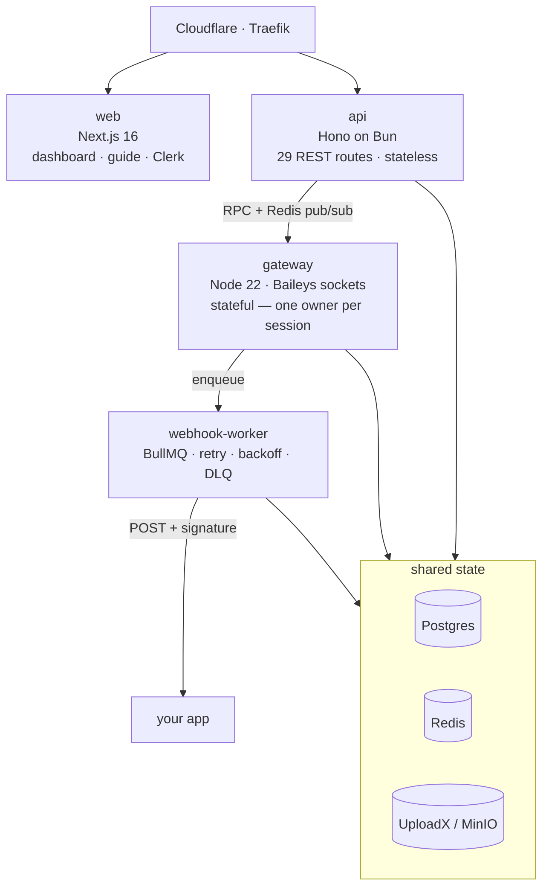
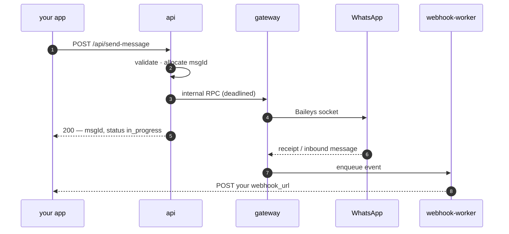

<p align="center">
  
</p>

<h1 align="center">wapi</h1>

<p align="center">
  <strong>WhatsApp over HTTP, on your own box.</strong><br>
  A self-hosted REST API for WhatsApp, wire-compatible with WasenderAPI.
</p>

<p align="center">
  <a href="https://wapi.crafter.run">Site</a> ·
  <a href="https://wapi.crafter.run/docs">Guide</a> ·
  <a href="https://api.wapi.crafter.run/docs">API reference</a> ·
  <a href="https://api.wapi.crafter.run/openapi.json">OpenAPI</a>
</p>

---

Link a number, get an API key, send and receive messages over plain HTTP.

```bash
curl -X POST https://api.wapi.crafter.run/api/send-message \
  -H "Authorization: Bearer $KEY" \
  -d '{"to":"+51999888777","text":"hello"}'
```

```json
{ "success": true, "data": { "msgId": 100024, "jid": "+51999888777", "status": "in_progress" } }
```

Meta's Cloud API covers business messaging, not the conversations most teams actually run
on — group chats, personal threads, the number people already message. Reaching those means
driving a real WhatsApp client. wapi does that and puts a stable REST surface in front of it.

## Architecture



The gateway is the only stateful piece: a WhatsApp session is a live socket that exactly one
process may own. Everything else scales sideways. Credentials live in Postgres rather than on
disk, so a redeploy reconnects instead of asking you to scan a QR again.

The dashboard is both halves of that picture: link a number and watch its QR, then browse its
contacts, groups and message log, watch webhook deliveries land as they happen, and run a
health check that sends one message to the number itself and tells you what actually works.



## From a terminal

Each release attaches a binary with the Bun runtime inside it, so there is no runtime to install
alongside and nothing to keep in step with it:

```bash
# Linux, x64
curl -fsSL -o wapi https://github.com/crafter-station/wapi/releases/latest/download/wapi-linux-x64

# macOS, Apple Silicon
curl -fsSL -o wapi https://github.com/crafter-station/wapi/releases/latest/download/wapi-darwin-arm64
xattr -d com.apple.quarantine wapi   # else Gatekeeper refuses an unsigned download

chmod +x wapi && sudo mv wapi /usr/local/bin/
wapi --version
```

Windows, in PowerShell — put `wapi.exe` anywhere on your `PATH`:

```powershell
irm https://github.com/crafter-station/wapi/releases/latest/download/wapi-windows-x64.exe -OutFile wapi.exe
```

`latest` follows the newest release; replace it with `download/v0.2.0` to pin one. Each release
also carries `SHA256SUMS`, worth checking on a binary you did not watch being built. Working in
this repo already? `bun apps/cli/src/index.ts` runs the same CLI without downloading anything.

Then:

```bash
wapi login                                   # approve a code in your browser
wapi sandbox create --use                    # a fake number, no phone needed
wapi sessions connect                        # pairs itself in a few seconds
wapi send --to +51999888777 --text "hello"
```

Every one of the API's 57 operations has a command, and a guard fails CI when one does not.
`--json` on anything makes it composable with `jq`; exit codes are `0` success, `2` usage, `3`
credentials. `wapi api GET /api/status` reaches anything without a command yet, attaching the
right credential by reading the route's declared scope.

See [`apps/cli`](apps/cli) for how the commands are put together.

## No phone? Use a sandbox

Linking a real number needs a phone, a QR scan, and a number you are willing to have banned. A
sandbox session needs none of them — a fake number on a fake WhatsApp that pairs itself, and goes
through the same routes and the same code as a real session.

```bash
curl -X POST https://api.wapi.crafter.run/api/sandbox/sessions   -H "Authorization: Bearer $PAT" -d '{"name":"my sandbox"}'
```

It has a small directory, accepts sends, and — the point — can be made to *receive* messages, so
your webhook handler gets a genuine signed delivery to prove itself against.

It is also the only safe place to rehearse the **writes**: creating a group, promoting or removing
participants, leaving, blocking a contact. Each of those touches real people on a real number.
Here the participants are invented, and the read-back works — a created group is listed, an invite
code is accepted, a saved name shows up in the directory.

The dashboard gives a sandbox its own **Sandbox** tab: the invented contacts, the conversation as
it happens, and a box to write a message *as* one of those contacts — the shortest path from "I
have a webhook handler" to "I have watched it run".

## Run it

```bash
bun install
cp .env.example .env      # Postgres, Redis, Clerk, UploadX
bun run typecheck && bun test
docker compose up
```

`bun test` covers unit, contract and SDK-compat suites; the ones needing a running stack or a real
number skip themselves rather than fail. The dashboard has its own browser suite
(`bun run --cwd apps/web e2e`) — see [`apps/web/e2e/README.md`](apps/web/e2e/README.md) for the
one-time Chromium and Clerk setup.

The full stack is four services plus Postgres, Redis and object storage —
see [`docker-compose.yaml`](docker-compose.yaml). Deployment targets a
[Dokploy](https://dokploy.com) VPS from a single root [`Dockerfile`](Dockerfile).

## Compatibility

46 endpoints reproduced from the WasenderAPI interface, down to the parts nobody would design
on purpose: **six** distinct success envelopes, **three** failure envelopes, and **two**
unrelated pagination shapes. Two neighbouring group endpoints even report participant changes in
two different shapes — reproduced, not tidied. Their published npm client runs against wapi
unmodified — only the base URL changes:

```ts
const wa = createWasender(process.env.WAPI_KEY, undefined, "https://api.wapi.crafter.run/api");
```

That is every endpoint they document except the four **Passkey** ones, which cannot be cloned:
they broker a WhatsApp WebAuthn ceremony through WasenderAPI's own service and a browser
extension, and Baileys has no equivalent. Those answer `501`, which is honest — a stubbed `200`
would not be.

That claim is a test suite, not an aspiration: response schemas are checked against the
provider's own documented examples, and again against live responses.

## Clients

Zero runtime dependencies either side. Types are generated from the OpenAPI document so they
cannot drift from the server; method names are hand-written, because generated ones read
`postApiWhatsappSessionsWhatsappSessionRegenerateKey`.

Neither is published to a registry — they live in [`sdk/`](sdk), so installation comes from here.

**Go** — resolves subdirectory modules natively:

```bash
go get github.com/crafter-station/wapi/sdk/go@main
```

```go
client := wapi.New(os.Getenv("WAPI_KEY"))
res, err := client.Messages.Send(ctx, "+51999888777", wapi.Text("hello"))
```

**Python** — pip understands git subdirectories:

```bash
pip install "git+https://github.com/crafter-station/wapi.git#subdirectory=sdk/python"
```

```python
client = WapiClient(api_key=os.environ["WAPI_KEY"])
client.messages.send(to="+51999888777", text="hello")
```

**TypeScript** — vendored, because npm cannot install a subdirectory of a git repository and
this one sits in a monorepo:

```bash
npx giget@latest gh:crafter-station/wapi/sdk/typescript/src src/wapi
```

```ts
const wapi = new WapiClient({ apiKey: process.env.WAPI_KEY! });
await wapi.messages.send({ to: "+51999888777", text: "hello" });
```

## Building with an agent

```bash
npx skills@latest add crafter-station/wapi --skill=wapi-nextjs
```

Ships a server-only client, a webhook route handler, and the API's non-obvious behaviour —
so your agent writes the integration correctly the first time.
[Read it first](.claude/skills/wapi-nextjs); skills run with your agent's permissions.

## Worth knowing

wapi is built on [Baileys](https://github.com/WhiskeySockets/Baileys), which speaks
WhatsApp's protocol directly. That is what makes group access possible, and it is **against
WhatsApp's terms** — numbers driven this way can be restricted or banned. Each session can route
through its own proxy (http, https or socks5, covering both the socket and media transfers) and
an account-protection mode paces sends. Neither is a guarantee.

**Use a number you can afford to lose.**

## Layout

| Path | |
| --- | --- |
| `apps/api` | Hono on Bun — the 46 cloned routes, stateless |
| `apps/gateway` | Node 22 — Baileys sockets, internal RPC only |
| `apps/webhook-worker` | BullMQ — delivery with retry and backoff |
| `apps/web` | Next.js 16 — dashboard, guide, Clerk auth |
| `apps/cli` | Bun — `wapi`, covering all 57 operations |
| `packages/contracts` | Zod contracts + the emitted OpenAPI document |
| `packages/core` | shared logic, `WhatsAppEngine` and `Storage` interfaces |
| `packages/db` | Drizzle schema and migrations |
| `packages/baileys-auth` | Postgres-backed `AuthenticationState` |
| `sdk/typescript` | TypeScript client — generated types, hand-written surface |
| `sdk/python` | Python client — stdlib only, same surface |
| `sdk/go` | Go client — `net/http` only, nested module |
| `compat/` | SDK-compatibility, fidelity (sandbox) and live integration suites |
| `apps/web/e2e` | Playwright — the only thing that renders a page |

Design decisions and their reasoning live in [`PLAN.md`](PLAN.md); repo conventions and the
traps worth knowing before changing anything are in [`AGENTS.md`](AGENTS.md).
